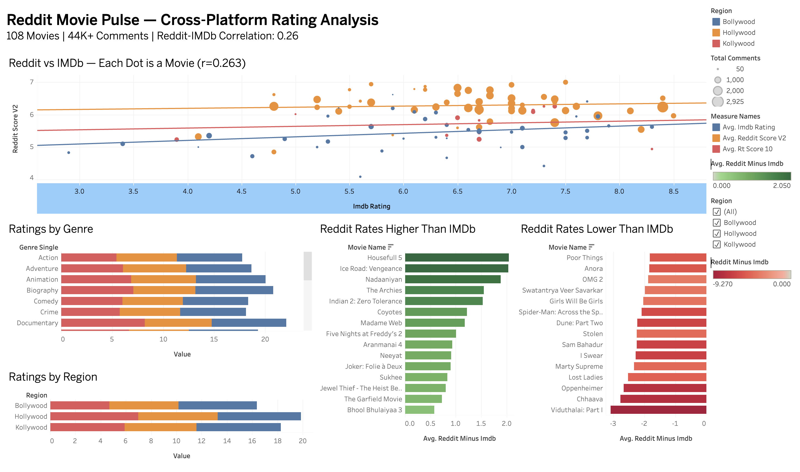

# Reddit Movie Pulse — Cross-Platform Movie Rating Analysis

## Overview

Built an end-to-end data pipeline that scrapes 44,000+ Reddit comments across 571 movies (Hollywood, Bollywood, Kollywood), performs multilingual sentiment analysis, and compares Reddit-derived scores against IMDb and Rotten Tomatoes ratings.

**Core Finding:** **Core Finding:** Reddit ratings are weakly correlated with IMDb (r=0.263) and Rotten Tomatoes (r=0.298), while IMDb and RT agree strongly (r=0.685). A predictive model using Reddit features barely outperforms naive baseline (0.3% improvement), confirming Reddit represents a genuinely independent movie rating system.

**Dashboard:** [View on Tableau Public](https://public.tableau.com/app/profile/athulya.biju/viz/Book1_17727323861070/Dashboard1)

## Dashboard



## Architecture

```
TMDB API → Movie metadata (571 movies, 5 regions)
                ↓
OMDB API → IMDb ratings + Rotten Tomatoes scores
                ↓
        Snowflake (RAW schema) → movies_master table
                ↓
Reddit Scraper → 44,102 comments across 211 movies
                ↓
        Snowflake (RAW schema) → reddit_comments_v2 table
                ↓
Sentiment Analysis (4 models) → scored comments
                ↓
        Snowflake (ANALYTICS schema)
                ↓
Platform Comparison → Reddit vs IMDb vs RT
                ↓
Predictive Modeling → Can Reddit predict IMDb ratings?
                ↓
Tableau Dashboard → Interactive visualization
```


## Key Results

| Metric | Value |
|--------|-------|
| Movies compared | 108 (with all 3 platform ratings) |
| Reddit comments analyzed | 44,102 |
| Reddit–IMDb correlation | 0.263 (weak, statistically significant) |
| Reddit–RT correlation | 0.298 (weak, statistically significant) |
| IMDb–RT correlation | 0.685 (strong) |
| Prediction accuracy (RF) | MAE = 0.758 (barely beats baseline of 0.761) |
| Early prediction (7 days) | MAE = 0.918 |
| Best sentiment model | RoBERTa (correlation: 0.416 with explicit ratings) |
| Non-English comments | 10.9% (handled via Multilingual BERT) |

## Sentiment Model Comparison

Compared 4 sentiment models against 588 comments with explicit user ratings (e.g., "8/10"):

| Model | MAE | Correlation | Type |
|-------|-----|-------------|------|
| VADER | 2.65 | 0.125 | Lexicon-based |
| TextBlob | 2.29 | 0.127 | Lexicon-based |
| RoBERTa | 1.94 | 0.416 | Transformer |
| Multilingual BERT | 1.93 | 0.365 | Multilingual Transformer |

## Interesting Findings

- **Reddit is harsher:** Average Reddit score (5.88) vs IMDb (6.46) vs RT (6.07)
- **Biggest genre gaps:** Biography (-1.62) and History (-1.96) — Reddit undervalues prestige films
- **Regional differences:** Bollywood RT scores (4.90) are much lower than IMDb (6.23) — critics don't rate Bollywood well
- **Prediction insight:** Negative comment ratio is the strongest predictor of IMDb ratings, not average sentiment score
- **Language matters:** 10.9% of comments were non-English, concentrated in Bollywood (14%) and Kollywood (21%) subreddits
- **Prediction confirms independence:** Random Forest (MAE=0.758) barely outperforms naive baseline (MAE=0.761), proving Reddit sentiment is fundamentally independent from IMDb, not a noisy proxy

## Tech Stack

- **Languages:** Python
- **APIs:** TMDB, OMDB, Reddit (unauthenticated JSON endpoints)
- **NLP:** VADER, TextBlob, HuggingFace Transformers (RoBERTa, Multilingual BERT), langdetect
- **ML:** scikit-learn (Random Forest, Linear Regression, cross-validation)
- **Data Warehouse:** Snowflake (RAW + ANALYTICS schemas)
- **Visualization:** Tableau Public, Matplotlib, Seaborn
- **Libraries:** pandas, numpy, scipy, requests

## Project Structure

```
├── get_movies_v2.ipynb           # TMDB + OMDB data collection
├── scraper_2.py                  # Reddit comment scraper
├── snowflake_conn.py             # Snowflake connection helper
├── sentiment_analysis_v2.ipynb   # VADER + TextBlob + RoBERTa comparison
├── multilingual_sentiment.ipynb  # Multilingual BERT + language detection
├── platform_comparison.ipynb     # Reddit vs IMDb vs RT analysis
├── predictive_modeling.ipynb     # ML models to predict IMDb from Reddit
├── tableau_data_prep.ipynb       # Prepare data for Tableau dashboard
├── .env.example                  # Required environment variables
├── images/
│   ├── dashboard.png
│   └── scraper_running.png
```

## Setup

1. Clone the repo
2. Create a `.env` file based on `.env.example`
3. Install dependencies: `pip install pandas requests snowflake-connector-python vaderSentiment textblob transformers langdetect scikit-learn matplotlib seaborn scipy python-dotenv`
4. Run notebooks in order: `get_movies_v2` → `scraper_2` → `sentiment_analysis_v2` → `multilingual_sentiment` → `platform_comparison` → `predictive_modeling`

## Future Improvements

- Migrate to PRAW (Reddit API wrapper) for authenticated access and deeper comment pagination
- Add Tollywood and Mollywood movie coverage
- Fine-tune a sentiment model specifically on movie review text
- Build a real-time Reddit sentiment tracker for new releases
- Add Streamlit dashboard for live monitoring
